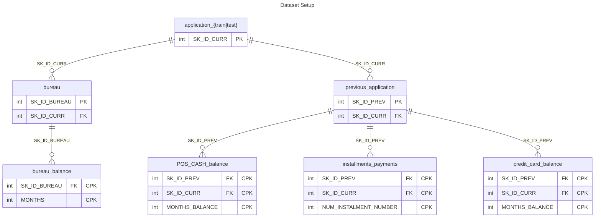

# Home Credit Group's Default Risk Prediction Competition (Hosted on Kaggle)
How capable of repaying a loan is each applicant?

Many people struggle to get loans due to insufficient or non-existent credit histories. And, unfortunately, this population is often taken advantage of by untrustworthy lenders.

# Project Overview

#  strives to broaden financial inclusion for the unbanked population by providing loans to individuals with limited or no credit history via a positive and safe borrowing experience

This project addresses the Kaggle competition [Home Credit Default Risk](https://www.kaggle.com/competitions/home-credit-default-risk/overview) which challenges participants to predict the probability of loan default for Home Credit Group's clients using a variety of alternative data.

While Home Credit Group is currently using various statistical and machine learning methods to make these predictions, they challenged Kagglers to help them unlock the full potential of their data. 
Doing so will ensure that clients capable of repayment are not rejected and that loans are given with a principal, maturity, and repayment calendar that will empower their clients to be successful. Accurately assessing the risk of loan default is crucial for the company's sustainability and for ensuring responsible lending practices.

# Executive Summary

1. The best performing stacked machine learning model achieved a promising $ROC AUC score = 0.75715$, indicating its effectiveness in distinguishing between clients likely to repay and those at higher risk of default.
2. External credit scores from credit bureaus were found to be strong indicators of repayment probability.

# Evaluation

For this project, submissions were evaluated on [area under the ROC curve](http://en.wikipedia.org/wiki/Receiver_operating_characteristic) between the predicted probability and the observed target.

### ROC curve calculation

The receiver operating characteristic (ROC) curve is a plot of the *true positive rate (TPR)* __against__ the *false positive rate (FPR)* at various threshold settings

$$ TPR = f(FPR)$$

where:

$$ TPR = \frac{TruePositives}{TruePositives + FalseNegatives}$$
$$ FPR = \frac{FalsePositives}{TrueNegatives + FalsePositives}$$

The area under the ROC curve (AUC for short) reduces the ROC curve to a single value, which represents the expected performance of the classifier. An AUC close to 1 indicates a good classifier.

---

  
<h1>Data</h1> (click ▶ to expand)

### This project utilizes several interconnected datasets provided by Home Credit Group:

|  | **application\_{train\|test}** | **bureau** | **bureau\_balance** | **previous\_application** | **POS\_CASH\_balance** | **credit\_card\_balance** | **installments\_payments** | **HomeCredit\_columns\_description** |
|---|---|---|---|---|---|---|---|---|
| **Description** | The main files containing information about each loan application, with the training data including the `TARGET` variable indicating loan repayment status. | Data on clients' previous credits from other financial institutions. | Monthly balances of the previous credits reported in `bureau.csv`. | Details of all previous loan applications at Home Credit by clients in the main application data. | Monthly balance snapshots of previous point-of-sale and cash loans clients had with Home Credit. | Monthly balance snapshots of previous credit cards clients had with Home Credit. | Repayment history for previous loans at Home Credit. | Provides descriptions for all columns in the various data files. |
| **Utilitization** | This was the main train and test data so I used it as the basis of my analysis of predicting the `TARGET` variable  | Merged with `bureau\_balance` to better understand applicant credit histories. | Merged with `bureau` to better understand applicant credit histories. | I opted to exclude this data from my analysis due to computing limitations as well as to remove bias from previous applications and their approval/rejections affecting analysis of current and future loan applicants. | Merged with 2 other sheets to better understand balances and payments made in previous credit that had been extended to loan applicants. | Merged with 2 other sheets to better understand balances and payments made in previous credit that had been extended to loan applicants. | Merged with 2 other sheets to better understand balances and payments made in previous credit that had been extended to loan applicants. | Created a notebook HomeCredit_columns_description.ipynb that acted as a quick reference guide in VS Code. |

---

  
<h1>Project Workflow</h1> (click ▶ to expand)

1.  **Business Understanding:** Defined the problem and the goals of Home Credit Group as listed above.
2.  **Data Loading and Exploration:** Loaded the datasets and performed exploratory data analysis (EDA) to understand data characteristics, identify missing values, analyze feature distributions, and look for relationships with the target variable.
3.  **Feature Engineering:** Merged and encoded features to enhance the predictive power of the models. Also removed collinear features to improve predictions and reduce compute. This included handling missing data, encoding categorical variables, and merging information from related tables.
4.  **Model Building and Evaluation:** Trained and evaluated several machine learning classification models to predict the probability of loan default. This involved addressing the class imbalance inherent in the dataset and using appropriate evaluation metrics such as ROC AUC.
5.  **Model Tuning and Selection:** Explored hyperparameter tuning techniques primarily using `GridSearchCV` to optimize model performance and selected the best-performing model. Also bagged my models with a stacking classifier to better utilize the power of various models.
6.  **Prediction Generation:** Used the selected model to generate predictions on the test dataset (`application_test.csv`).

---
  
<h1>Next Steps</h1> (click ▶ to expand)

*   Further exploration of feature engineering techniques, potentially incorporating more complex aggregations and interactions across different data sources.
*   More extensive hyperparameter tuning and optimization of the selected model.
*   Experimentation with advanced modeling techniques, such as deep learning models or ensemble methods.
*   Focus on model interpretability to understand the factors driving the predictions.
*   Consideration of different business-driven thresholds for classifying loan applications based on the predicted probabilities.

###### Citation

Anna Montoya, inversion, KirillOdintsov, and Martin Kotek. Home Credit Default Risk. https://kaggle.com/competitions/home-credit-default-risk, 2018. Kaggle.
